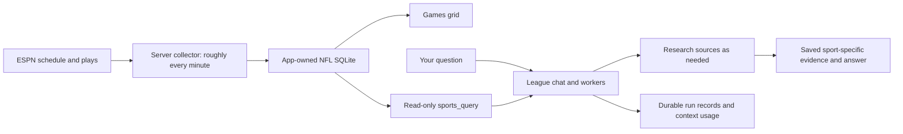

# Sandbox Harness

A deliberately thin local agent harness: an OpenAI or Gemini model can use a persistent Docker workspace and a Stagehand-controlled browser through a simple chat interface.

[Saved NFL game data](docs/nfl-data.md) — automatically collect current-season ESPN games, refresh active games roughly every minute, and query saved play-by-play from NFL chats.

[Persistence and run audits](docs/persistence-and-runs.md) — Docker persistence, verified NFL backups, and per-run tool/model inspection.

Durable files live locally in Git-ignored `.data/`. Stopped sandboxes restart against those same files; uploads and browser downloads publish complete artifacts, and command output is saved in bounded local logs. Agents can retrieve prior evidence with `history_read` when their tool permissions allow it.

[Slash commands](docs/commands.md) — use `/roster` in NFL chats, discover workflows with `/help`, and register reusable commands that automatically appear in both help and the menu.

The composer has a per-chat model selector beside a context ring. Click the ring for the latest request's input usage, verified model capacity, and separate run compaction trigger; `~` marks estimates. Unknown model limits remain unknown, and measurements persist with new assistant messages.

The adjacent provider usage control shows recorded tokens and estimated spend across that provider's models in retained chat and worker audits. Missing usage or pricing is marked partial or unavailable. This is an app estimate, not your provider account bill; see [coverage and pricing](docs/persistence-and-runs.md#metrics-and-limits).

## Current sports flow



NFL collection makes no model calls and continues while the server runs. Chats share research within NFL or NBA, with each sport kept separate. News research happens on request; the five-minute background news agent and monitoring settings are removed.

## What it includes

- Shared persistent files, including SQLite (`sqlite3`) so the agent can create task-specific databases and schemas. Select NFL or NBA with the workspace toggle; New chat inherits that sport. Chats in the same sport reuse saved research, scripts, and league settings; the two sports keep separate files. Each workspace starts with a `LEAGUE.md` for your website, team, and rules, initially unknown until supplied or verified.
- One Docker sandbox per chat, with the selected workspace mounted at `/workspace`. Chat history and browser profiles remain per chat.
- A small tool set: `exec`, `browser_open`, `browser_observe`, `browser_act`, `browser_extract`, and `browser_screenshot`.
- NFL chats and NFL workers additionally have `sports_query` for read-only SQL over imported games, subject to run-specific tool restrictions.
- A direct OpenAI Responses API or Google Gemini API tool loop with streamed text and visible tool activity.
- The main agent can delegate bounded assignments to instances of the same harness, selecting an OpenAI or Gemini model for each worker. Sub-agents appear as activity cards in the parent response, with their status, model, elapsed time, token usage, deliverable, and artifact downloads. They have no separate chats or message composer.
- File upload, browsing, explicit downloads, and confirmed deletion in the workspace UI.
- Markdown responses, including tables and code blocks, plus collapsed tool activity inside each assistant response. New tool activity is saved with chat history; older chats still show their saved text.
- Enter sends a message; Shift+Enter inserts a new line. The microphone records up to five minutes, then uses OpenAI Whisper (`whisper-1`) to add an editable transcript to your draft. Stop recording to transcribe, or Cancel to discard it.
- Agent-turn requests retry temporary HTTP 500/502/503/504 failures up to three times, waiting 2, 4, and 8 seconds. Retries preserve tool results and stop if response output has already started; retry status appears in the activity log.
- Empty Gemini completions and `MALFORMED_FUNCTION_CALL` responses without visible text share a two-retry limit with short delays. Malformed responses are discarded without executing their tools; retries preserve conversation state and include tool-schema guidance. Responses that already emitted visible text stop to avoid replaying a partial answer. Abnormal completions save metadata (no prompts, screenshots, or credentials) under `/workspace/.harness/model-diagnostics`; blocked or incomplete responses stop with their specific reason.
- The agent is instructed to validate extracted row counts and required fields against the source before analysis and retry incomplete extraction.
- Failed browser actions return a fresh observation and viewport screenshot. Immediate repeats of an unsuccessful action are blocked on an unchanged page; explicit observation, navigation, or manual control clears the guard. Errors thrown by the browser service remain retryable after inspection.
- Screenshot requests and failed browser actions send actual images to the selected model. Images stay out of text tool logs; PNG artifacts remain available in the workspace. Gemini keeps only the newest batch of screenshots in the current turn's context.
- The agent understands manual login in its shared Chromium window and checks the current page when you return control. Finish the agent turn before taking control, then tell it when you are done.
- Context management: a rolling durable summary plus six recent messages carry cross-turn state; large tool results are saved under `/workspace/.harness/tool-results` and screenshots under `/workspace/.harness/screenshots`. Earlier turns' tool traces and images are not replayed. OpenAI runs additionally use Responses API server-side compaction. Gemini compacts the current run into a progress summary at a tool boundary when its serialized context exceeds 60,000 characters.

## Prerequisites

- Node.js 22.13 or newer (built-in SQLite; experimental in Node 22)
- Docker Desktop running
- An OpenAI or Google Gemini API key

## Run it

```bash
cp .env.example .env
# Add OPENAI_API_KEY or GEMINI_API_KEY to .env
npm install
npm run sandbox:build
npm run dev
```

Open `http://127.0.0.1:3000`.

`npm run dev` watches the server and automatically refreshes open local harness tabs after a code change.

Voice input requires `OPENAI_API_KEY` in `.env`, even when Gemini handles the chat. The key stays on the server; recordings are sent to OpenAI for transcription and are not saved in the workspace. Your browser must allow microphone access and use HTTPS or localhost (plain HTTP on a LAN IP cannot access the microphone). For local microphone use, run `HOST=127.0.0.1 npm run dev` and open `http://127.0.0.1:3000`. Transcripts are never submitted automatically.

### Using Gemini

Set these values in `.env` (keep your key private):

```dotenv
MODEL_PROVIDER=gemini
GEMINI_API_KEY=your-gemini-api-key
GEMINI_MODEL=gemini-2.5-flash
```

Restart the server after editing `.env`. These settings choose the default model; each chat can save its own choice using the composer selector. Chat, durable memory, and browser actions use that chat's selected model. Gemini does not require an OpenAI key.

Set `MODEL_PROVIDER=openai` to switch back. If `MODEL_PROVIDER` is blank, the harness selects Gemini when only `GEMINI_API_KEY` is set; otherwise it defaults to OpenAI. When both keys are present, set the provider explicitly.

The selector lists configured primary and worker models for providers with an API key. Its saved choice applies to the chat's next main turn; it cannot change during an active run, worker, league refresh, or while archived. Workers keep their independently selected models. Switching models resets the live browser connection while retaining its saved profile and the conversation.

The Gemini integration uses Google's [Gen AI JavaScript SDK](https://googleapis.github.io/js-genai/release_docs/) and Stagehand's [Google model support](https://docs.stagehand.dev/v3/configuration/models).

## Chat views

Chats live in a collapsible left sidebar, the conversation stays in the center, and workspace controls live in the right rail. The sidebar shows the selected sport's **Active** or **Archived** chats and its **New chat** button.

The right rail groups **My matchup**, **Games**, **Teams**, and **Waivers** under **League**; **Files** under **Workspace**; and **Runs** and **Browser** under **Chat activity**. One content panel opens beside the conversation at a time and starts closed on page load or chat changes. Click its selected button, Close, or Escape to close it; the rail stays available.

The **NFL / NBA** toggle in the right rail switches sport workspaces and remembers the last chat in each sport. **New NFL chat** or **New NBA chat** creates a chat in the selected workspace. Switching sports preserves unsent drafts during the current page session and clears the previous sport's panel data. NBA uses ESPN Fantasy, but its league connection and NBA game collection are not implemented yet; NBA views show an explicit unconnected state rather than NFL data.

Each chat's options menu offers **Archive** and **Delete**. Archive keeps the conversation and research under **Archived**, where you can inspect or restore it. Permanent deletion removes the chat, its run history, workers, and browser profile; its dialog lets you select shared research files to remove, with none selected automatically. Unselected sport files and the NFL database remain. Stop active runs and workers first. See [chat retention](docs/persistence-and-runs.md#archive-and-permanent-deletion).

- **My matchup** shows your Sleeper NFL starters beside this week's opponent, fantasy points, game times/status, and your collapsible bench. **Refresh data** runs the bundled roster script in Docker without model calls; **Check my lineup** drafts a research question using the saved roster and a request to verify current injuries and lock rules. Scores and the daily injury catalog show separate retrieval times.
- **Games** shows the saved NFL schedule and freshness, available in NFL chats.
- **Teams** opens a searchable league overview with team records and roster/position counts. Choose a team to open **Trade builder**: independently scroll and filter both rosters, build a **You send / You receive** package, then draft a trade discussion. It reads saved `/roster` data and displays its retrieval time; **Ask agent to refresh** drafts `/roster` for you to send.
- **Waivers** searches active, league-eligible NFL players absent from every saved roster. Filter by position or NFL team, select a possible pickup and optional drop, and draft a research question. Ownership and catalog freshness are shown separately; claim eligibility still needs verification. The view uses cached data and submits no claims.
- **Runs** shows main-agent and worker audits: tool inputs/results, interruptions, model usage, and final output. Select a run to inspect evidence; large records load in parts.
- **Files** shows uploads, reports, and **League settings** (`LEAGUE.md`). Internal `.harness/` artifacts are hidden from this list; their files and direct artifact links remain available.
- **Browser** becomes available with browser activity. A browser tool opens the panel automatically if it is closed. It does not replace another selected view, and repeated frames do not reopen a panel you minimized. Take control remains available when the agent is idle.

On narrow screens, the chat sidebar opens as an overlay, and content panels cover the conversation with a Close control. The right rail remains visible. Opening a view does not change NFL collection cadence.

## Research on request

Ask the NFL or NBA chat to investigate a player, trade, lineup, or news question. The harness can browse sources, execute scripts, and save research in that sport's workspace. Supply your roster and scoring rules for league-specific questions; saved evidence needs freshness checks before reuse.

Automatic news polling, Gemini headline screening, and background news research have been removed. There are no monitoring controls or `MONITOR_*` settings. OpenAI and Gemini settings still configure interactive chats and workers. Automatic NFL schedule and play-by-play collection continues independently, without model calls.

Existing research remains at its original paths. Old background runs under `.data/workspaces/<sport>/runs/` with `request.json` origin `monitor` stay hidden from Files; agents and direct workspace file downloads can still access them. The old `.data/monitor/` state is inactive and is not loaded by the server. Its queue will not resume. Monitoring-specific package download endpoints have been removed; saved `output/result-*.json` packages remain available on disk and through workspace downloads.

## Notes

- Sport workspaces live at `.data/workspaces/nfl` and `.data/workspaces/nba`, created on first use. Each UI chat links `.data/sessions/<id>/workspace` to its selected folder. New-chat requests require `workspaceId: "nfl"` or `"nba"`; custom workspace creation is unavailable. Earlier chats remain accessible through history with their existing folders; files are not moved or merged. Replay and shadow-evaluation scripts still create isolated workspaces.
- The browser uses CloakBrowser's persistent Chromium profile with Stagehand attached in `LOCAL` mode for browser actions. CloakBrowser manages graceful browser shutdown to save login storage. CloakBrowser downloads its binary on the first browser session; the host does not need a separate Chrome/Chromium installation.
- Each chat saves its Chromium profile at `.data/sessions/<id>/browser-profile`, outside the Docker workspace and file-download routes. Sign in once in the harness browser after enabling this; persistent cookies and site storage are reused when you reopen the same chat after a restart. Existing temporary browser logins are not migrated. New chats have separate profiles, and sites can still expire logins. Profiles are local and excluded from Git.
- The agent has broad control over its own Docker workspace. This is a prototype harness, not a hardened multi-user environment.
- `OPENAI_MODEL` defaults to `gpt-5.6-luna`; set it in `.env` to use another model your account supports.
- `GEMINI_MODEL` defaults to `gemini-2.5-flash`; set it in `.env` to use another Gemini model your account supports.

## Sub-agents

Ask the main agent to delegate independent work, for example:

> Use an OpenAI worker to analyze the uploaded data and a Gemini worker to check the calculations. Start both, collect their results, and explain any disagreement.

The orchestrator uses `agent_start`, `agent_read`, `agent_wait`, and `agent_cancel`.
Each assignment includes a task, selected context, and an expected deliverable.
Workers use the same agent loop and tool implementations, with one additional
`finish_task` tool that returns `completed`, `partial`, or `blocked`, a summary,
the requested output, artifact references, and limitations. Progress text and
private transcripts are not delivered as the result. Output is limited to 8,000
characters; larger deliverables must be files. The parent verifies the results.

Both providers can run concurrently when their keys are configured. By default,
the available worker models are `OPENAI_MODEL` and `GEMINI_MODEL` (or their normal
defaults). Override the worker allowlists with comma-separated model IDs:

```dotenv
OPENAI_SUBAGENT_MODELS=gpt-5.6-luna
GEMINI_SUBAGENT_MODELS=gemini-2.5-flash
```

Only models available to your accounts should be configured. Selection is fixed
for each worker and applies to its model calls, compaction, and browser actions.
Worker execution is limited to two concurrent workers across the server, eight
assignments per parent turn, 40 model calls per worker, and 15 minutes per attempt.
Workers cannot delegate further and inherit the parent's tool/network restrictions.
Model requests have a two-minute timeout. Parent runs have a 100-call, 30-minute
execution limit after cross-turn memory refresh. Usage shown on each worker card
counts its agent-loop and context-compaction calls; browser-service model usage
is not included.

Each worker has its own Docker sandbox and writable `/workspace`, with parent
files mounted read-only at `/inputs`. Its browser has a separate persistent
profile. If login or clarification is required, the worker returns `blocked` to
the orchestrator. Files submitted through `finish_task` are copied into the
parent's `subagent-results/<worker-id>/` directory; coding workers can return
patches for the parent to apply. Each artifact must be a workspace file no larger
than 25 MB. Private state is stored under `.data/agents/<worker-id>/`, outside the
parent's Docker workspace and chat/file routes.

Reloading the page reconnects to the running parent and restores worker cards.
Stop cancels the parent and its active workers; each active card also has a Stop
worker button. Cancellation stops the worker's sandbox and preserves its private
files. Completed results survive server restarts. Interrupted workers are marked
`interrupted`, and the orchestrator can use `agent_resume` to continue the same
assignment from a safe checkpoint, up to three attempts. This is a continuation
of the saved task, with no worker chat. A checkpoint with pending tool calls is
not automatically replayed: the orchestrator must reconcile possible effects and
start a new assignment. Partial files and diagnostics remain in the worker's
private directory for local inspection.

Run the deterministic lifecycle and loop checks with:

```bash
npm run test:subagents
```

These checks use fake model responses and temporary workspaces. Docker is used
for sandbox cleanup; browser checks with real providers require the configured
keys and a running Docker Desktop.

## NBA lineup evaluation

`fixtures/fantasy-nba-dk` is a controlled NBA, DraftKings-style historical
evaluation. The agent receives only `visible/` pre-game-style data and must
write a legal recommendation plus a persistent SQLite checkpoint in its chat
workspace. The hidden outcome file is used only afterwards by the grader.

Run the evaluator after a harness chat has created its artifacts:

```bash
npm run fantasy:grade -- .data/sessions/<chat-id>/workspace
```

The output reports lineup legality, SQLite checkpoint status, realized points,
hindsight-optimal points, and regret. It verifies the harness workflow and is
not evidence of real-world forecast accuracy; replace the fixture with sourced
pregame snapshots and official box scores before making performance claims.

### Historical replay loop

`fixtures/fantasy-nba-replay` contains 20 historical 2023–24 slates generated
from a third-party MIT-licensed box-score dataset derived from NBA data. Every
visible rolling statistic is calculated from games strictly before the target
date; target-date fantasy points live only in each fixture's `hidden/` folder.
The manifest records the source URL, source hash, leakage policy, and important
limitations. These first slates intentionally omit historical injuries,
betting lines, salaries, and DraftKings bonuses.

Rebuild fixtures after downloading the source CSV to the default ignored path:

```bash
npm run fantasy:fixtures
```

Run deterministic baselines without spending model tokens:

```bash
npm run fantasy:replay -- --limit 20
```

Run the real harness agent on a bounded number of slates:

```bash
npm run fantasy:replay -- --agent --limit 3
```

Each agent replay gets a clean chat workspace containing only `visible/` data.
The runner freezes the recommendation, reveals the outcome to the grader, and
stores legality, checkpoint validity, regret, latency, tool calls, and token
usage in `.data/evals/fantasy-replays.sqlite`. Every row includes a fixture
hash so regenerated datasets cannot be compared accidentally. The latest detailed report is
also written to `.data/evals/latest-fantasy-replay.json`.

### One-shot sealed shadow test

The stronger `fantasy-nba-shadow-v1` protocol reserves five agent-unseen
historical slates. It anonymizes player, team, and date identifiers, exposes
only the shell tool, starts Docker with `--network none`, permits exactly one
attempt per slate, and separates prediction from outcome grading into distinct
processes. Predictions and SQLite checkpoints are hashed and sealed before the
grader reads any hidden outcome file.

```bash
npm run fantasy:shadow:register
npm run fantasy:shadow:predict
npm run fantasy:shadow:grade
```

The state machine is `REGISTERED -> PREDICTING -> SEALED -> SCORED`. Prediction
cannot be rerun after leaving `REGISTERED`; failures consume their attempt.
The selected model must match the registered protocol's `model`. For a Gemini
shadow test, register a separate protocol with a new `id` and the Gemini model
name before prediction; the existing OpenAI protocol remains fixed.
Results are written under `.data/evals/shadow/nba-shadow-final-five-v1/` as
sealed artifact bundles, `report.json`, `REPORT.md`, and `results.sqlite`.
